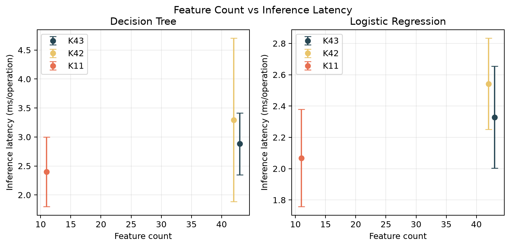
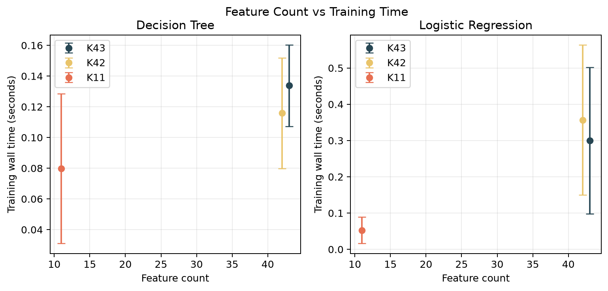
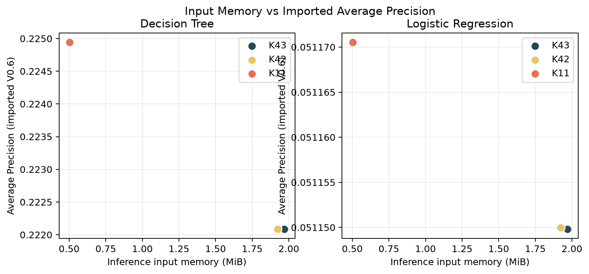
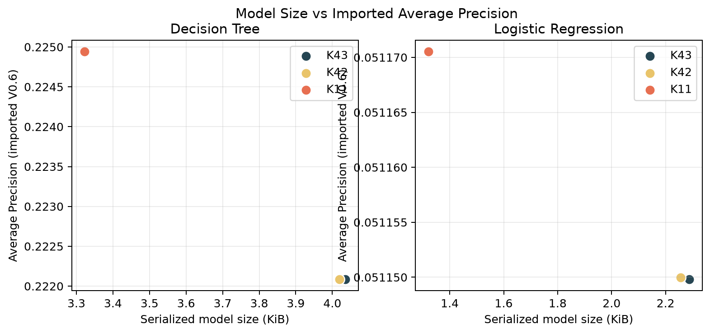
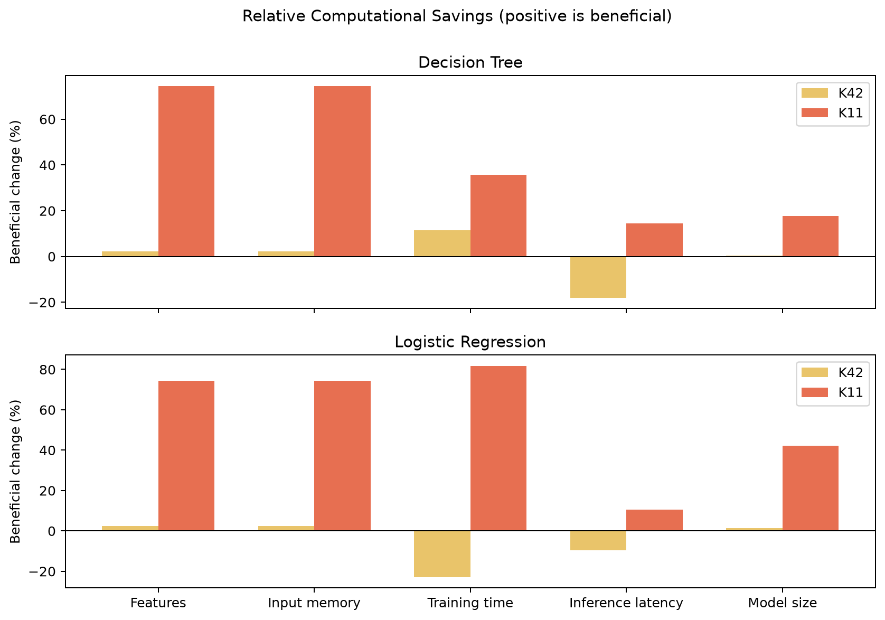
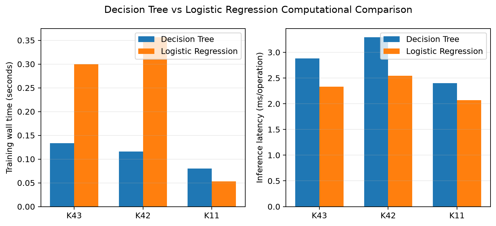
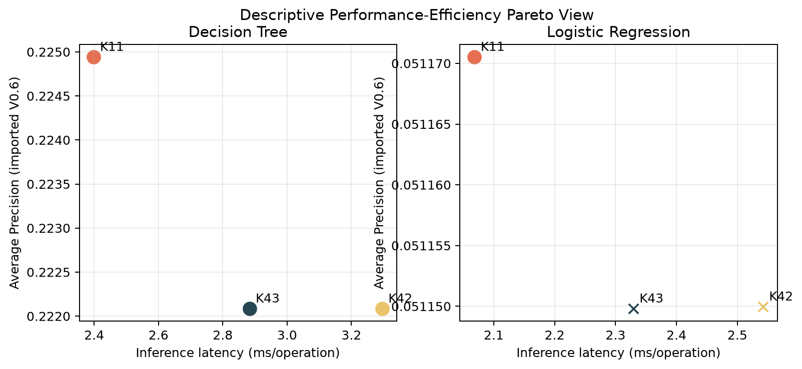
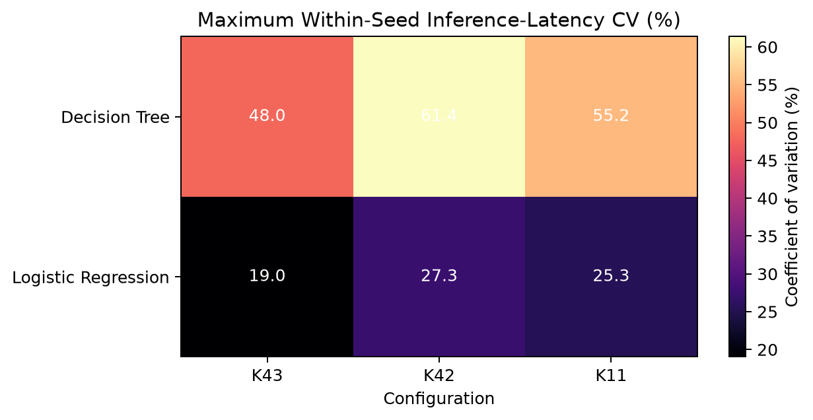

# V0.7-F Green AI Evaluation Report

- **Project:** A Lightweight and Green Blockchain-AI Framework for Secure and Energy-Efficient Supply Chain Management
- **Stage:** V0.7-F, artifact-only research notebook and final Green AI evaluation report
- **Evidence base:** Completed V0.7-C direct-energy capability assessment, V0.7-D computational benchmark, and V0.7-E statistical analysis
- **Analysis policy:** Frozen-evidence reporting only; no experiment reruns, model training, attack regeneration, feature reselection, threshold tuning, or artifact modification

## Abstract

V0.7 evaluated whether feature-space reduction lowers recurring computational cost while retaining the predictive behavior locked by V0.6. The controlled benchmark compared the 43-feature full baseline, a 42-feature pairwise-correlation configuration, and an 11-feature mutual-information configuration for Decision Tree and Logistic Regression classifiers over seeds 42-46. V0.7-D completed all 600 planned fresh-worker observations without failure. Ten measurement repetitions were averaged within each seed, and V0.7-E used the five paired seed means as the scientific units.

MI K=11 reduced feature count by 74.42%, selected-input memory by approximately 74.41%, mean serialized model size by 17.77% for Decision Tree and 42.22% for Logistic Regression, and absolute peak RSS by 1.03-9.79% depending on classifier and phase. Logistic Regression training wall time fell by 81.81% with a paired 95% interval wholly in the reduction direction. Decision Tree training time and both classifiers' inference latencies had favorable means but intervals crossing zero. Timing variability was high in 33 of 36 timing summaries, so those uncertain differences cannot support dependable latency claims. All configurations retained the frozen primary-scenario predictive preservation descriptor, but absolute attack-detection performance remained modest.

No direct electrical-energy backend passed preflight in WSL2. V0.7 therefore establishes computational-efficiency evidence, not measured joules, electrical-energy savings, carbon savings, or statistical significance. Its strongest conclusion is that MI K=11 provides substantial deterministic reductions in feature, input, memory, and model-artifact costs while preserving the specified frozen predictive behavior.

## 1. Research Question and Scope

The primary research question was:

> To what extent does frozen feature-space reduction reduce recurring computational cost and, when valid hardware instrumentation exists, measured energy consumption while retaining the locked cybersecurity detection performance?

V0.7 addresses this question after V0.6 locked the candidate configurations. Feature selection itself is outside the V0.7 timing boundary. Predictive metrics are imported from immutable V0.6-F and V0.6-G evidence, while computational measurements come from a common V0.7-D environment and protocol.

This stage does not implement BPSO, BGWO, hybrid optimization, weighted Green AI scoring, deployment validation, or an integrated Blockchain-AI decision framework. It supplies governed classical baselines for those later comparisons.

## 2. PRD Traceability

| Research requirement | V0.7 contribution |
|---|---|
| Lightweight and Green AI evaluation | Measures controlled training and inference time, CPU time, RSS, selected-input bytes, model bytes, and throughput |
| Predictive preservation | Imports the immutable V0.6 metrics and preservation decisions without reopening selection |
| Reproducibility | Uses a frozen protocol, five seeds, ten repetitions per cell, workload hashes, and complete raw observations |
| Fair comparison | Pairs reduced and baseline seed means within classifier, phase, metric, workload, and environment |
| Energy governance | Separates direct computational measurements, direct energy, derived values, historical values, and estimates |
| Statistical treatment | Reports descriptive means, variability, paired differences, and two-sided 95% Student-t intervals over five seeds |
| Future optimizer baseline | Preserves the 43-feature and MI K=11 anchors for V0.8-V1.0 comparisons |

## 3. Frozen Experimental Design

### 3.1 Configurations and classifiers

| Role | Configuration ID | Features | Reduction |
|---|---|---:|---:|
| Full baseline | `none_natural` | 43 | 0.00% |
| Best unsupervised | `pairwise_correlation_filter_natural` | 42 | 2.33% |
| Best supervised / smallest preserving | `mutual_information_select_k_best_k11` | 11 | 74.42% |

The classifiers remained fixed:

| Classifier | Frozen parameters |
|---|---|
| Decision Tree | `max_depth=5`, `min_samples_leaf=20`, `class_weight="balanced"`, seed-specific `random_state`, threshold 0.5 |
| Logistic Regression | `solver="liblinear"`, `class_weight="balanced"`, `max_iter=500`, `C=1.0`, seed-specific `random_state`, threshold 0.5 |

### 3.2 Workloads and boundaries

- Training used the frozen 28,000-row controlled training workload.
- Inference used the fixed 6,000-record mixed 5% MEDIUM test workload.
- Seeds were exactly 42, 43, 44, 45, and 46.
- Each classifier/configuration/seed/phase cell had ten outer repetitions in fresh workers.
- Inference used 512 operations per measured observation after three untimed warm-up calls.
- Model loading, preprocessing, feature-selector discovery, and serialization were outside inference timing.
- Feature projection and classifier fitting were measured under the recurring training protocol.
- Calibration observations were excluded from the 600 scientific benchmark rows.
- All observations were retained; no outlier was removed.

The completed matrix was:

```text
3 configurations x 2 classifiers x 5 seeds x 2 phases x 10 repetitions = 600 observations
```

V0.7-D reports 300 successful training observations, 300 successful inference observations, and zero failures.

### 3.3 Environment

The benchmark ran in WSL2 on a 12th Gen Intel Core i7-1255U with 6 physical and 12 logical CPUs. The environment exposed approximately 8.18 GB RAM. BLAS/OpenMP-related thread variables were constrained to one. The recorded Python version was 3.12.3 with NumPy 2.5.2, pandas 3.0.5, psutil 7.2.2, and scikit-learn 1.9.0.

Absolute measurements are specific to this environment. They must not be pooled with V0.5 or V0.6 measurements collected under different process boundaries, runtimes, or machines.

## 4. Measurement and Statistical Protocol

V0.7 distinguishes the following evidence classes:

| Class | V0.7 examples |
|---|---|
| Direct computational | Wall time, process CPU time, RSS, selected-input bytes, serialized artifact bytes |
| Direct energy | Hardware-counter or calibrated external-meter joules; unavailable in this run |
| Derived | Per-operation latency, per-record latency, throughput, relative change |
| Imported historical | Frozen V0.6 predictive metrics |
| Estimated | Historical TDP-times-time calculation; excluded from direct-energy evidence |

Ten repetitions characterize measurement variability but are not ten independent scientific samples. They were averaged within seed first. Paired comparisons then used the five seed means and reported a two-sided 95% Student-t interval with four degrees of freedom.

The paired difference is:

```text
reduced seed mean - baseline seed mean
```

Relative change is:

```text
100 x (reduced - baseline) / baseline
```

For minimized resources, a negative relative change is a reduction. The V0.7-E labels `clear_reduction`, `clear_gain`, `clear_increase`, and `clear_loss` describe whether the paired interval remains on one side of zero. They are not claims of statistical significance.

## 5. Direct-Energy Feasibility

No backend passed the direct-energy acceptance gate:

| Backend | Decision | Reason |
|---|---|---|
| Linux RAPL | Rejected | No `energy_uj` counters were exposed under WSL2 powercap |
| Windows EMI | Rejected | WSL is not native Windows EMI access |
| NVML | Rejected | Optional dependency unavailable and GPU telemetry is irrelevant to the CPU-only sklearn workload |
| External meter | Rejected | No meter was configured or claimed |
| Historical estimate | Estimate only | TDP-times-time is not a hardware energy measurement |

The authoritative decision is `DIRECT_ENERGY_UNAVAILABLE`. No accepted backend, joule result, watt result, carbon result, or CO2e result exists. Computational efficiency is relevant to Green AI, but lower time or memory must not be relabeled as measured electrical-energy savings.

## 6. Frozen Predictive Performance

| Classifier | Configuration | Features | AP | F1 | Recall | Precision | ROC-AUC | Preserved |
|---|---|---:|---:|---:|---:|---:|---:|---|
| Decision Tree | Full baseline | 43 | 0.222084 | 0.189005 | 0.305333 | 0.265385 | 0.603533 | Yes |
| Decision Tree | Pairwise correlation | 42 | 0.222084 | 0.189005 | 0.305333 | 0.265385 | 0.603533 | Yes |
| Decision Tree | MI K11 | 11 | 0.224941 | 0.192121 | 0.300000 | 0.293470 | 0.605495 | Yes |
| Logistic Regression | Full baseline | 43 | 0.051150 | 0.087348 | 0.423333 | 0.048824 | 0.494000 | Yes |
| Logistic Regression | Pairwise correlation | 42 | 0.051150 | 0.087348 | 0.423333 | 0.048824 | 0.493999 | Yes |
| Logistic Regression | MI K11 | 11 | 0.051171 | 0.092457 | 0.510000 | 0.050907 | 0.500645 | Yes |

These metrics are imported historical evidence rather than V0.7 measurements. The preservation label reapplies the preregistered V0.6 descriptive margins. It is not a formal non-inferiority conclusion.

Decision Tree remains materially stronger in AP and F1 for the primary workload. Logistic Regression's higher recall is accompanied by precision near 0.05 and many false positives. Absolute performance is not sufficient for a production-ready cybersecurity claim.

## 7. MI K=11 Computational Results

### 7.1 Decision Tree

| Resource | Full baseline | MI K11 | Observed beneficial change | Interpretation |
|---|---:|---:|---:|---|
| Training wall time | 0.133787 s | 0.079739 s | 35.78% lower | Uncertain; relative interval -88.61% to +17.05% |
| Inference latency per 6,000-record operation | 0.002883 s | 0.002399 s | 14.55% lower | Uncertain; relative interval -46.70% to +17.60% |
| Inference throughput | 2,184,640 records/s | 2,774,345 records/s | 28.36% higher | Clear gain; relative interval +4.31% to +52.40% |
| Training absolute peak RSS | 167.393 MiB | 157.070 MiB | 6.17% lower | Clear reduction |
| Inference absolute peak RSS | 155.266 MiB | 153.003 MiB | 1.46% lower | Clear reduction |
| Training selected-input bytes | 9,632,132 | 2,464,132 | 74.42% lower | Deterministic reduction |
| Inference selected-input bytes | 2,064,132 | 528,132 | 74.41% lower | Deterministic reduction |
| Mean serialized model bytes | 4,132.0 | 3,402.4 | 17.77% lower | Clear reduction |

The throughput and latency summaries are derived differently and average nonlinear quantities. The throughput interval remains favorable while the latency interval crosses zero; both must be reported rather than selecting the more favorable statistic.

Decision Tree incremental training RSS increased from 0.135 MiB to 2.763 MiB, a large relative increase from a very small baseline. This does not contradict the 6.17% reduction in absolute peak RSS. It shows that absolute and boundary-increment memory describe different quantities and that interpreter/library baseline memory dominates the process total.

### 7.2 Logistic Regression

| Resource | Full baseline | MI K11 | Observed beneficial change | Interpretation |
|---|---:|---:|---:|---|
| Training wall time | 0.299947 s | 0.052786 s | 81.81% lower | Clear reduction; relative interval -88.16% to -75.46% |
| Inference latency per 6,000-record operation | 0.002329 s | 0.002068 s | 10.56% lower | Uncertain; relative interval -26.27% to +5.15% |
| Inference throughput | 2,657,222 records/s | 3,021,305 records/s | 14.45% higher | Uncertain; relative interval -6.32% to +35.22% |
| Training absolute peak RSS | 183.118 MiB | 165.192 MiB | 9.79% lower | Clear reduction |
| Inference absolute peak RSS | 154.125 MiB | 152.536 MiB | 1.03% lower | Clear reduction |
| Training incremental peak RSS | 21.898 MiB | 10.790 MiB | 50.73% lower | Clear reduction |
| Training selected-input bytes | 9,632,132 | 2,464,132 | 74.42% lower | Deterministic reduction |
| Inference selected-input bytes | 2,064,132 | 528,132 | 74.41% lower | Deterministic reduction |
| Mean serialized model bytes | 2,342.0 | 1,353.2 | 42.22% lower | Clear reduction |

Logistic Regression provides the clearest recurring fit-cost result. Its training-time reduction is large and consistent across paired seeds. Its inference result is directionally favorable but not distinguishable from the observed measurement noise under the defined interpretation policy.

## 8. Pairwise-Correlation Results

Pairwise correlation removes one of 43 features. Selected-input bytes fell by approximately 2.33%, Decision Tree model size by 0.39%, and Logistic Regression model size by 1.37%. Absolute training RSS fell by 0.20% for Decision Tree and 0.50% for Logistic Regression.

Timing did not show a dependable gain. Decision Tree training and inference timing intervals crossed zero. Logistic Regression pairwise training was 23.05% slower with a paired interval wholly in the adverse direction, while its inference timing remained uncertain. These results support the preregistered expectation that removing one feature yields negligible or noise-level recurring efficiency gains and can be outweighed by runtime variability.

## 9. Measurement Variability

V0.7-E marked 33 of 36 wall-time, per-operation-latency, and throughput summaries as high timing variability under the 20% rule. Examples include:

- Decision Tree MI K11 training wall time: 49.23% between-seed CV and up to 71.21% within-seed CV.
- Decision Tree MI K11 inference latency: 20.18% between-seed CV and up to 55.20% within-seed CV.
- Logistic Regression full-baseline training wall time: 54.26% between-seed CV and up to 54.63% within-seed CV.
- Logistic Regression MI K11 inference latency: 12.10% between-seed CV and up to 25.33% within-seed CV.

No slow observation was discarded. This protects against favorable-run filtering but leaves broad intervals around several timing differences. Deterministic byte counts and stable absolute RSS patterns provide stronger evidence than most short-duration timing comparisons in this WSL environment.

## 10. Performance-Efficiency and Pareto Analysis

V0.7-E constructed a descriptive, unweighted Pareto analysis over predictive performance and computational resources. No objective weights or composite score were used.

| Classifier | Configuration | Pareto status |
|---|---|---|
| Decision Tree | Full baseline | Non-dominated |
| Decision Tree | Pairwise correlation | Non-dominated |
| Decision Tree | MI K11 | Non-dominated |
| Logistic Regression | Full baseline | Dominated by MI K11 |
| Logistic Regression | Pairwise correlation | Dominated by MI K11 |
| Logistic Regression | MI K11 | Non-dominated |

All Decision Tree configurations remain non-dominated because of differing predictive metrics and noisy timing trade-offs. MI K11 dominates both Logistic Regression alternatives across the selected descriptive objectives. Pareto membership does not constitute a multi-objective optimization algorithm or prove general superiority.

## 11. Hypothesis Assessment

| Hypothesis | Outcome | Evidence |
|---|---|---|
| H1: MI K11 reduces selected-input memory by about 74.4% | Supported | 74.42% training and 74.41% inference reductions |
| H2: MI K11 reduces latency and increases throughput for both classifiers | Not generally supported | Favorable means, but both latency intervals and Logistic Regression throughput interval cross zero; Decision Tree throughput is a clear gain |
| H3: MI K11 reduces Logistic Regression fitting cost more consistently than Decision Tree fitting cost | Supported | LR training time is 81.81% lower with a wholly favorable interval; DT training time is uncertain |
| H4: Pairwise correlation yields negligible or noise-level gains | Supported with caveat | Deterministic reductions are only 0.39-2.33%; timing is uncertain or adverse for LR training |
| H5: Absolute RSS changes much less than input memory | Supported | MI input bytes fall about 74.4%, while absolute RSS falls 1.03-9.79% |
| H6: Model size need not decrease proportionally with feature count | Supported | 74.42% feature reduction produces only 17.77% DT and 42.22% LR model-size reductions |
| H7: MI K11 uses less directly measured energy | Untested | No direct backend passed preflight |

## 12. Key Figures

















## 13. Experimental Facts

- V0.7-D completed 600/600 benchmark observations with zero failures.
- The matrix contains three locked configurations, two classifiers, five seeds, two phases, and ten measurement repetitions.
- All V0.7-D and V0.7-E governance checks passed.
- V0.6 predictive metrics were imported only; V0.7-E performed no model training or workload regeneration.
- MI K11 reduces feature count from 43 to 11, or 74.4186%.
- MI K11 preserves the frozen primary-scenario predictive descriptors for both classifiers.
- MI K11 clearly reduces selected-input bytes, absolute peak RSS, and serialized model size for both classifiers.
- Logistic Regression MI K11 clearly reduces recurring training time by 81.81%.
- Decision Tree training time and both classifiers' inference latency reductions remain uncertain.
- Timing variability is high in 33 of 36 timing summaries.
- Pairwise correlation removes one feature and does not demonstrate a dependable timing gain.
- No direct-energy or carbon result was produced.
- No observation was removed and no statistical-significance claim was made.

## 14. Scientific Interpretation

V0.7 conditionally supports the Green AI research objective at the computational-efficiency level. The 11-feature MI configuration has substantially lower deterministic data movement and storage requirements, lower absolute process memory, and smaller model artifacts while retaining the V0.6 primary-scenario performance descriptor. Logistic Regression also demonstrates a clear recurring training-time reduction.

The evidence does not justify a blanket statement that fewer features always make inference faster. Short operations were amplified, but WSL host effects and runtime noise remained material. Favorable mean latency differences for MI K11 have intervals crossing zero. The scientifically defensible wording is therefore "observed but uncertain latency reduction," not "proven faster inference."

Likewise, computational savings do not prove electrical-energy savings. A lower operation count or wall time may plausibly reduce energy under controlled hardware conditions, but no accepted counter measured that quantity. The direct-energy hypothesis remains open for native Linux RAPL, validated native Windows EMI, or calibrated external-meter evaluation.

## 15. Limitations

1. CPU direct energy was unavailable in the WSL2 environment.
2. No electrical-energy or carbon conclusion can be drawn from timing, RSS, or byte counts.
3. Timing variability was high for most timing summaries.
4. The evaluation uses one fixed DataCo split and does not quantify cross-dataset or cross-organization generalization.
5. Controlled data modifications are not equivalent to native cyber incidents.
6. Only a Decision Tree and Logistic Regression were evaluated.
7. The fixed primary workload is mixed 5% MEDIUM; V0.7 did not repeat the V0.6 robustness sweep.
8. Predictive performance is modest and does not support production readiness.
9. Five seeds provide limited uncertainty resolution.
10. Nominal t-intervals with `n=5` rely on a small-sample model and are descriptive.
11. MI K11 uses seed-specific selected feature sets rather than one universal subset.
12. Absolute RSS contains interpreter and library overhead and does not isolate model memory.
13. Incremental RSS for very short boundaries is quantized and can yield unstable relative percentages.
14. Selector-acquisition cost is historical V0.6 evidence and is not pooled into recurring V0.7 timing.
15. Measurements from V0.5, V0.6, native Windows, native Linux, Colab, or other machines are not directly interchangeable with this run.

## 16. Conclusions

V0.7 answers the computational part of its research question affirmatively but with metric-specific qualifications. Frozen MI K11 dimensionality reduction preserves the specified primary-scenario predictive behavior and clearly lowers selected-input memory, absolute peak RSS, and model-artifact size for both classifiers. It also clearly lowers Logistic Regression training time. Decision Tree training-time and general inference-latency benefits remain uncertain under the observed variability.

The 42-feature pairwise configuration is a useful near-baseline control but does not provide a compelling operational efficiency benefit. MI K11 is the strongest reduced Green AI proxy baseline for later optimization stages, while the 43-feature configuration remains the required full baseline.

The energy part of the research question remains unanswered. The correct V0.7 conclusion is computational efficiency with no direct-energy evidence, not energy-efficient operation in joules and not carbon reduction.

## 17. Future Work

V0.8 BPSO, V0.9 BGWO, and V1.0 hybrid comparisons should rerun the full and MI K11 anchors in the same target environment. They must preserve the frozen data, attack, model, threshold, warm-up, repetition, and pairing protocol and must report optimizer-search cost as a separate phase.

A future direct-energy extension should use native Linux RAPL, verified native Windows EMI, or a calibrated external meter. It should preflight counter resolution, measure an amplified workload, keep package and wall scopes separate, and report gross joules before any idle-adjusted sensitivity calculation. Computational proxies should remain separately labeled even when direct energy becomes available.

## 18. Reproducibility and Artifact Provenance

The executable artifact-only notebook is `notebooks/v07_green_evaluation.ipynb`. It locates the repository root, verifies required files, validates every SHA-256 entry in `v07e_artifact_hashes.json`, asserts governance and observation counts, displays frozen tables and figures, and records its outputs. It does not import or invoke a V0.7 experiment pipeline.

Primary evidence includes:

- `results/green_evaluation/energy_capability.json`
- `results/green_evaluation/environment_metadata.json`
- `results/green_evaluation/v07d_run_manifest.json`
- `results/green_evaluation/v07d_governance_audit.json`
- `results/green_evaluation/computational_observations.csv`
- `results/green_evaluation/v07e_seed_summaries.csv`
- `results/green_evaluation/v07e_paired_comparisons.csv`
- `results/green_evaluation/v07e_efficiency_summary.csv`
- `results/green_evaluation/v07e_performance_efficiency.csv`
- `results/green_evaluation/v07e_variability_analysis.csv`
- `results/green_evaluation/v07e_pareto_analysis.csv`
- `results/green_evaluation/v07e_governance_audit.json`
- `results/green_evaluation/v07e_artifact_hashes.json`
- `results/green_evaluation/figures/`

The notebook can be re-executed from the repository root without rerunning a scientific pipeline:

```bash
python -m jupyter nbconvert --to notebook --execute --inplace \
  --ExecutePreprocessor.timeout=600 notebooks/v07_green_evaluation.ipynb
```
